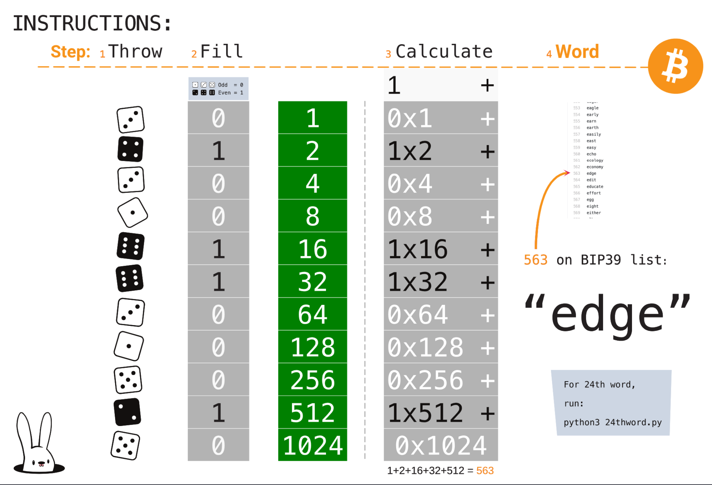

# Bip39 Offline Mnemonic Generator

This is a pdf + code containing the instructions and the English BIP39 list for offline generation a full BIP39 24 word seed. The first 23 words are generated using paper and dice, and the 24th word is generated using the script `24thword.py`.

## Step 1: First 23 words

Print the pdf,  grab a pen, a pocket calculator (optional) and some dice and generate the first 23 words. 

## What now?

To determine the final 24th word, on an OFFLINE machine, edit `rolls.txt` and replace the words with the 23 that you chose using dice. Then run:

`python3 24thword.py`

You will be given a list of 8 valid 24th words. Pick one (no need to tell the program which), write it with the other 23. This is a valid wallet seed, and you can use it with [Electrum](http://electrum.org) or some other wallet application.

## Thanks!

Code for 24th word was based on [avsync/bip39chk](https://github.com/avsync/bip39chk)

## License

GPL 3.0
